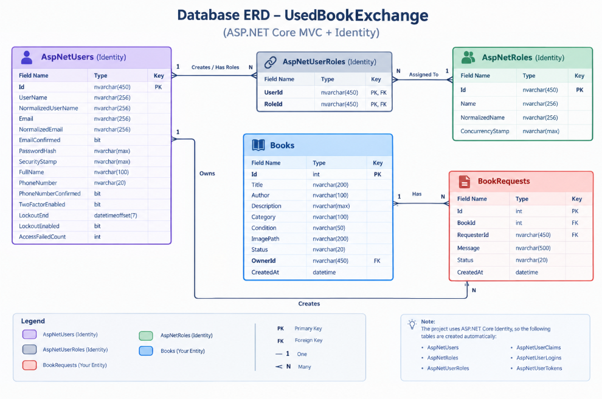

# UsedBookExchange

A web-based platform for exchanging used books between users.
The application allows users to list books they no longer need, discover available books, and submit exchange requests through a structured workflow.

The project was developed using **C# and ASP.NET Core MVC** with a focus on clean architecture, maintainable code, validation, security, and separation of responsibilities.

##  Problem Statement

Many people own books that they no longer use while other people may be looking for the same books.

Traditional book exchange is usually handled informally, making it difficult to:

* Discover available books.
* Find books by title or author.
* Track exchange requests.
* Manage the status of exchanged books.
* Maintain a clear record of users and requests.

**UsedBookExchange** provides a centralized web platform that simplifies the process of listing, discovering, and exchanging used books.

##  Solution

The system provides a structured marketplace-like experience where:

1. Users create an account and log in.
2. Users list books they want to exchange.
3. Other users browse, search, and filter available books.
4. A user can submit a request for an available book.
5. The book owner can accept or reject the request.
6. Accepted requests reserve the book.
7. Completed exchanges change the book status to `Exchanged`.
8. Administrators can monitor users, books, requests, and platform statistics from a dedicated dashboard.

---

##  Features

###  Authentication & Authorization

* User registration.
* User login and logout.
* ASP.NET Core Identity.
* Password validation.
* Unique email validation.
* Role-based authorization.
* Admin role.
* Protected admin dashboard.

###  Book Management

Users can:

* Add a new book.
* Edit their own books.
* Delete their own books.
* Upload book images.
* View book details.
* Search books by title or author.
* Filter books by category.
* Filter books by condition.

Supported book conditions:

* New
* Like New
* Good
* Acceptable

###  Exchange Request Workflow

Users can submit requests for books.

Request statuses:

```text
Pending
   ↓
Accepted ──→ Completed
   │
   └──────→ Rejected
```

Book statuses:

```text
Available
    ↓
Reserved
    ↓
Exchanged
```

Business rules include:

* A user cannot request their own book.
* A request cannot be submitted for an unavailable book.
* Duplicate pending requests are prevented.
* Only the book owner can accept or reject requests.
* An accepted request reserves the book.
* A completed request marks the book as exchanged.

###  Image Upload

The application supports book image uploads.

Security and validation include:

* Maximum file size: 5 MB.
* Supported formats:

  * JPG
  * JPEG
  * PNG
  * WEBP
* Unique file names generated using `Guid`.
* Uploaded files are stored outside the source-controlled repository.

###  Admin Dashboard

The application includes a single-page administration dashboard.

The dashboard provides:

* Platform statistics.
* Registered users.
* Listed books.
* Exchange requests.
* Book status overview.
* Request status overview.

Admin sections:

```text
Dashboard
Users
Books
Requests
Back to Website
Logout
```

The dashboard is protected using:

```csharp
[Authorize(Roles = "Admin")]
```

---

##  Architecture

The project follows a layered structure with clear separation of responsibilities.

```text
UsedBookExchange
│
├── UsedBookExchange.Domain
│   ├── Entities
│   ├── Enums
│   └── DTOs
│
├── UsedBookExchange.Infrastructure
│   ├── Data
│   ├── Identity
│   ├── Configurations
│   └── Repositories
│
└── UsedBookExchange.Web
    ├── Controllers
    ├── Services
    ├── ViewModels
    ├── Views
    └── wwwroot
```

### Domain

Contains the core business entities and application-independent models.

Examples:

* `Book`
* `BookRequest`
* `BookStatus`
* `BookCondition`
* `RequestStatus`
* Admin DTOs

### Infrastructure

Responsible for external concerns such as:

* Entity Framework Core.
* SQL Server.
* Database configuration.
* ASP.NET Core Identity persistence.
* Repository implementations.
* Entity configurations.

### Web

Responsible for:

* MVC Controllers.
* Razor Views.
* ViewModels.
* Authentication flow.
* Request handling.
* Image upload services.
* User interface.

---

##  Design Patterns & Practices

The project applies several common software development practices:

### Repository Pattern

Database access is abstracted through repository interfaces.

Example:

```text
IBookRepository
       ↓
BookRepository
```

This reduces direct database access from controllers and improves maintainability.

### Dependency Injection

Services and repositories are registered through ASP.NET Core's built-in Dependency Injection container.

### DTOs

DTOs are used to transfer data between infrastructure and the web layer without exposing infrastructure-specific implementation details.

### ViewModels

ViewModels are used specifically for the MVC presentation layer.

This keeps UI concerns separated from domain entities.

### Entity Configurations

Entity Framework configurations are separated from the entities using:

```csharp
IEntityTypeConfiguration<T>
```

This keeps database configuration organized and maintainable.

---

##  Database

The application uses:

* **SQL Server**
* **Entity Framework Core**
* **ASP.NET Core Identity**

Main application entities include:

```text
ApplicationUser
Book
BookRequest
```

Identity provides the authentication and authorization tables.

Entity Framework Core migrations are used to manage database schema changes.

---
## Database ERD

The database is built using Entity Framework Core and ASP.NET Core Identity.

The main application entities are:

- Books
- BookRequests

Authentication and authorization are handled by ASP.NET Core Identity.



##  Security

The project includes several security measures:

* Role-based authorization.
* Authentication using ASP.NET Core Identity.
* Anti-forgery protection for POST forms.
* Ownership validation for book operations.
* Business-rule validation for exchange requests.
* Input validation using Data Annotations.
* File type validation for uploaded images.
* File size validation.
* Secrets are not stored in source control.

Sensitive configuration such as administrator credentials should be provided through **User Secrets** or environment variables.

---

##  Error Handling

The application includes centralized error handling for production environments.

It provides:

* Custom error page.
* HTTP status code handling.
* Request ID tracking.
* Logging through ASP.NET Core logging.
* User-friendly error messages.

Examples include handling:

```text
404 - Not Found
403 - Forbidden
500 - Internal Server Error
```

---

##  Validation

Validation is applied at multiple levels.

### ViewModel Validation

Examples:

* Required fields.
* Maximum string lengths.
* Book condition validation.

### Business Validation

Examples:

* Cannot request your own book.
* Cannot request an unavailable book.
* Cannot submit duplicate pending requests.
* Only owners can manage their books and requests.

This prevents invalid operations from reaching the database.

---

##  Technologies

| Technology              | Purpose                            |
| ----------------------- | ---------------------------------- |
| C#                      | Programming language               |
| ASP.NET Core MVC        | Web framework                      |
| Entity Framework Core   | ORM                                |
| SQL Server              | Database                           |
| ASP.NET Core Identity   | Authentication & Authorization     |
| Razor Views             | UI                                 |
| HTML / CSS / JavaScript | Frontend                           |
| Git                     | Version control                    |
| GitHub                  | Source control and project hosting |

---

##  Prerequisites

Before running the project, install:

* .NET 8 SDK
* SQL Server
* Visual Studio 2022 or another compatible IDE
* Git

---

##  Getting Started

### 1. Clone the repository

```bash
git clone https://github.com/boshraakkas/UsedBookExchange.git
```

### 2. Navigate to the project

```bash
cd UsedBookExchange
```

### 3. Configure the database

Update the connection string in your local configuration.

Do not commit sensitive credentials to GitHub.

Example:

```json
{
  "ConnectionStrings": {
    "DefaultConnection": "Server=YOUR_SERVER;Database=UsedBookExchange;Trusted_Connection=True;TrustServerCertificate=True;"
  }
}
```

### 4. Configure Admin Credentials

The application uses configuration for the initial administrator account.

For local development, use ASP.NET Core User Secrets instead of storing credentials in `appsettings.json`.

Example:

```bash
dotnet user-secrets set "Admin:Email" "your-admin-email"
dotnet user-secrets set "Admin:Password" "your-secure-password"
```

### 5. Apply database migrations

From the solution directory:

```bash
dotnet ef database update \
  --project UsedBookExchange.Infrastructure \
  --startup-project UsedBookExchange.Web \
  --context ApplicationDbContext
```

### 6. Run the application

```bash
dotnet run --project UsedBookExchange.Web
```

Then open the HTTPS address displayed by ASP.NET Core.

---

##  Administrator

The application automatically creates the `Admin` role and assigns the configured administrator account to it.

After signing in with the administrator account, the **Admin Dashboard** becomes available.

The administrator can monitor:

* Total users.
* Total books.
* Available books.
* Reserved books.
* Exchanged books.
* Pending requests.
* Registered users.
* Book listings.
* Exchange requests.

---

##  Project Structure

```text
UsedBookExchange/
│
├── UsedBookExchange.Domain/
│   ├── Entities/
│   │   ├── Book.cs
│   │   └── BookRequest.cs
│   │
│   ├── Enums/
│   │   ├── BookCondition.cs
│   │   ├── BookStatus.cs
│   │   └── RequestStatus.cs
│   │
│   └── DTOs/
│       ├── AdminUserDto.cs
│       ├── AdminBookDto.cs
│       └── AdminRequestDto.cs
│
├── UsedBookExchange.Infrastructure/
│   ├── Configurations/
│   ├── Data/
│   ├── Identity/
│   ├── Migrations/
│   └── Repositories/
│
├── UsedBookExchange.Web/
│   ├── Controllers/
│   ├── Models/
│   ├── Services/
│   ├── ViewModels/
│   ├── Views/
│   └── wwwroot/
│
└── README.md
```

---

##  Project Goals

The project was designed to demonstrate practical knowledge of:

* Problem analysis.
* Software architecture.
* C# programming.
* ASP.NET Core MVC.
* Entity Framework Core.
* SQL Server.
* Authentication and authorization.
* Repository Pattern.
* Dependency Injection.
* DTOs and ViewModels.
* Validation.
* Error handling.
* Secure file uploads.
* Maintainable code organization.
* Git and GitHub workflow.

---

##  Possible Future Improvements

The current version focuses on the core requirements of the platform.

Potential future improvements include:

* Email notifications.
* Advanced book recommendations.
* Pagination for large datasets.
* Real-time notifications.
* More advanced administrator actions.
* Automated tests with a larger coverage.
* API/mobile client support.

---

##  License

This project was created as a software engineering assessment project and is intended for educational and portfolio purposes.
